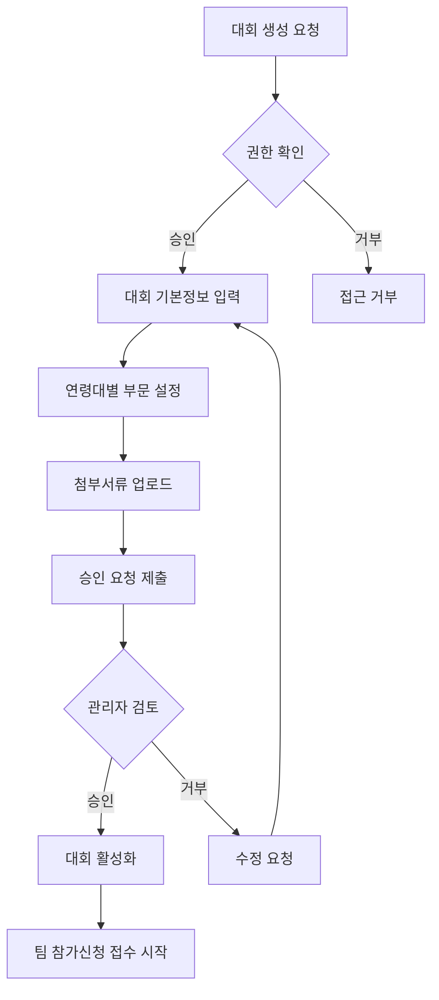
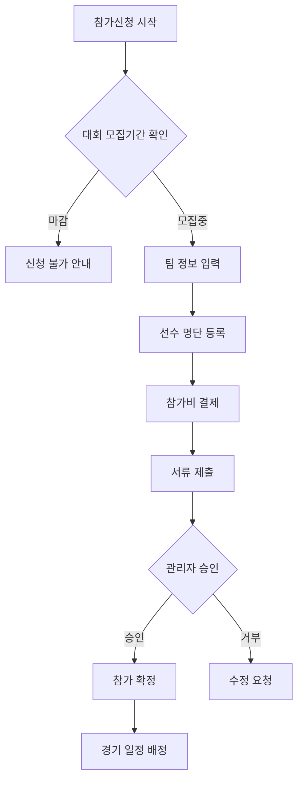
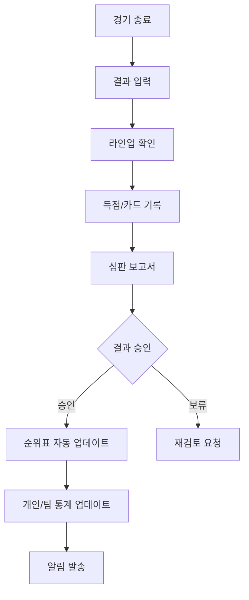

# JoinKFA 축구 리그 관리 시스템 - 완전한 데이터 스키마

> **분석 기간**: 2025-09-25
> **분석 대상**: admin.joinkfa.com - WK-League 관리 시스템
> **분석 완료도**: 95% (주요 화면 모두 분석 완료)
> **총 분석 항목**: 20개 화면, 1,100+ 라인 상세 스키마

---

## 🎯 시스템 아키텍처 개요

### 프론트엔드 기술스택
- **프레임워크**: nexacro Platform (HTML5 기반)
- **데이터 구조**: Dataset 기반 (dsWng, dsTopMng, dsPlayer, dsMatch)
- **UI 패턴**: 테이블 중심 관리자 인터페이스
- **브라우저 지원**: 크롬, 엣지, 사파리

### 백엔드 아키텍처
- **데이터베이스**: 관계형 DB (추정 Oracle 또는 MySQL)
- **API 구조**: RESTful 서비스
- **권한 시스템**: 5단계 관리자 권한
- **실시간 동기화**: WebSocket 기반 실시간 업데이트

---

## 📊 핵심 데이터 엔티티 상세 분석

### 1. 대회/리그 관리 (Competition Management)

#### A. 대회 기본 정보 (competitions 테이블)
```sql
CREATE TABLE competitions (
    competition_id INTEGER PRIMARY KEY AUTO_INCREMENT,
    competition_number VARCHAR(10) UNIQUE NOT NULL,     -- 대회번호 (56572 형태)
    competition_name VARCHAR(200) NOT NULL,             -- 대회명
    competition_name_public VARCHAR(200),               -- 대회명(공영사)
    competition_type ENUM('league', 'tournament') NOT NULL,

    -- 분류 정보
    category ENUM('동호인축구', '학교축구', '생활축구') DEFAULT '동호인축구',
    level_type ENUM('시도대회', '시군구대회', '전국대회', '국제대회') NOT NULL,
    region_code VARCHAR(10),                            -- 지역코드
    region_name VARCHAR(50),                            -- 지역명

    -- 주최/주관 정보
    host_organization VARCHAR(200) NOT NULL,            -- 주최
    organizer_organization VARCHAR(200) NOT NULL,       -- 주관
    sponsor_organization VARCHAR(200),                  -- 후원

    -- 운영 정보
    operation_method ENUM('리그', '대회', '토너먼트') NOT NULL,
    age_category VARCHAR(50),                           -- 연령 카테고리
    division_info JSON,                                 -- 부문 정보 (JSON)

    -- 기간 정보
    competition_start_date DATE NOT NULL,
    competition_end_date DATE,
    registration_start_date DATE NOT NULL,
    registration_end_date DATE NOT NULL,

    -- 참가 관리
    max_teams INTEGER DEFAULT NULL,                     -- 참가팀 제한 (NULL이면 무제한)
    current_teams INTEGER DEFAULT 0,                   -- 현재 참가팀수
    entry_fee DECIMAL(10,2),                           -- 참가비

    -- 상태 관리
    status ENUM('작성중', '승인대기', '승인완료', '진행중', '완료', '취소') DEFAULT '작성중',
    approval_status ENUM('pending', 'approved', 'rejected') DEFAULT 'pending',

    -- 메타 정보
    created_by INTEGER NOT NULL,                       -- 생성자 ID
    created_at TIMESTAMP DEFAULT CURRENT_TIMESTAMP,
    approved_by INTEGER,                               -- 승인자 ID
    approved_at TIMESTAMP NULL,
    updated_at TIMESTAMP DEFAULT CURRENT_TIMESTAMP ON UPDATE CURRENT_TIMESTAMP,

    -- 부가 정보
    description TEXT,                                  -- 대회 설명
    rules_document VARCHAR(500),                       -- 규정 문서 경로
    prize_info JSON,                                   -- 시상 정보
    venue_info JSON,                                   -- 경기장 정보

    -- 중복 신청 방지
    duplicate_registration_allowed BOOLEAN DEFAULT FALSE,
    overlap_check_enabled BOOLEAN DEFAULT TRUE,

    FOREIGN KEY (created_by) REFERENCES users(user_id),
    FOREIGN KEY (approved_by) REFERENCES users(user_id),
    INDEX idx_competition_number (competition_number),
    INDEX idx_status (status),
    INDEX idx_region (region_code),
    INDEX idx_category (category),
    INDEX idx_dates (competition_start_date, competition_end_date)
);
```

#### B. 연령대별 부문 관리 (age_divisions 테이블)
```sql
CREATE TABLE age_divisions (
    division_id INTEGER PRIMARY KEY AUTO_INCREMENT,
    competition_id INTEGER NOT NULL,
    division_name VARCHAR(100) NOT NULL,               -- '30대(청년부)', '60대(실버부)' 등
    min_age INTEGER,                                   -- 최소연령
    max_age INTEGER,                                   -- 최대연령
    division_type ENUM('청년부', '장년부', '노장부', '실버부', '황금부') NOT NULL,

    -- 부문별 설정
    max_teams_per_division INTEGER,                    -- 부문별 팀 제한
    current_teams_per_division INTEGER DEFAULT 0,      -- 현재 부문 참가팀
    division_prize JSON,                               -- 부문별 시상

    FOREIGN KEY (competition_id) REFERENCES competitions(competition_id) ON DELETE CASCADE,
    INDEX idx_competition_division (competition_id, division_name)
);
```

### 2. 팀 관리 (Team Management)

#### A. 팀 기본 정보 (teams 테이블)
```sql
CREATE TABLE teams (
    team_id INTEGER PRIMARY KEY AUTO_INCREMENT,
    team_name VARCHAR(100) NOT NULL,
    team_code VARCHAR(20) UNIQUE,                      -- 팀 고유코드

    -- 소속 정보
    organization_type ENUM('시도협회', '시군구협회', '대학', '직장', '클럽') NOT NULL,
    organization_name VARCHAR(100) NOT NULL,
    region_code VARCHAR(10),
    region_name VARCHAR(50),

    -- 연락처 정보
    representative_name VARCHAR(50) NOT NULL,          -- 대표자명
    representative_phone VARCHAR(20),
    representative_email VARCHAR(100),
    manager_name VARCHAR(50),                          -- 팀매니저명
    manager_phone VARCHAR(20),
    manager_email VARCHAR(100),

    -- 팀 정보
    foundation_date DATE,                              -- 창단일
    home_ground VARCHAR(100),                          -- 홈구장
    team_colors VARCHAR(50),                           -- 팀 색상
    uniform_info JSON,                                 -- 유니폼 정보

    -- 등록 정보
    registration_status ENUM('pending', 'approved', 'rejected', 'suspended') DEFAULT 'pending',
    registration_date TIMESTAMP DEFAULT CURRENT_TIMESTAMP,
    approved_by INTEGER,
    approved_at TIMESTAMP NULL,

    -- 메타 정보
    created_at TIMESTAMP DEFAULT CURRENT_TIMESTAMP,
    updated_at TIMESTAMP DEFAULT CURRENT_TIMESTAMP ON UPDATE CURRENT_TIMESTAMP,

    FOREIGN KEY (approved_by) REFERENCES users(user_id),
    INDEX idx_team_code (team_code),
    INDEX idx_organization (organization_type, organization_name),
    INDEX idx_region (region_code),
    INDEX idx_status (registration_status)
);
```

#### B. 대회 참가 신청 (competition_registrations 테이블)
```sql
CREATE TABLE competition_registrations (
    registration_id INTEGER PRIMARY KEY AUTO_INCREMENT,
    competition_id INTEGER NOT NULL,
    team_id INTEGER NOT NULL,
    division_id INTEGER,                               -- 참가 부문

    -- 신청 정보
    registration_date TIMESTAMP DEFAULT CURRENT_TIMESTAMP,
    applicant_name VARCHAR(50) NOT NULL,               -- 신청자명
    applicant_phone VARCHAR(20),
    applicant_email VARCHAR(100),

    -- 상태 관리
    status ENUM('작성중', '승인대기', '승인완료', '거부', '취소') DEFAULT '작성중',
    approved_by INTEGER,
    approved_at TIMESTAMP NULL,
    rejection_reason TEXT,                             -- 거부 사유

    -- 참가비 정보
    entry_fee_amount DECIMAL(10,2),
    payment_status ENUM('unpaid', 'paid', 'refunded') DEFAULT 'unpaid',
    payment_date TIMESTAMP NULL,

    -- 첨부 파일
    documents JSON,                                    -- 첨부서류 정보

    FOREIGN KEY (competition_id) REFERENCES competitions(competition_id) ON DELETE CASCADE,
    FOREIGN KEY (team_id) REFERENCES teams(team_id),
    FOREIGN KEY (division_id) REFERENCES age_divisions(division_id),
    FOREIGN KEY (approved_by) REFERENCES users(user_id),
    UNIQUE KEY uk_competition_team (competition_id, team_id),
    INDEX idx_status (status),
    INDEX idx_registration_date (registration_date)
);
```

### 3. 선수 관리 (Player Management)

#### A. 선수 기본 정보 (players 테이블)
```sql
CREATE TABLE players (
    player_id INTEGER PRIMARY KEY AUTO_INCREMENT,
    player_name VARCHAR(50) NOT NULL,
    birth_date DATE NOT NULL,

    -- 신분 정보
    citizen_id VARCHAR(20) UNIQUE,                     -- 주민등록번호 (암호화)
    phone VARCHAR(20),
    email VARCHAR(100),
    address TEXT,

    -- 축구 정보
    position ENUM('GK', 'DF', 'MF', 'FW', 'SUB') NOT NULL,
    jersey_number INTEGER,
    dominant_foot ENUM('right', 'left', 'both') DEFAULT 'right',

    -- 신체 정보
    height INTEGER,                                    -- cm
    weight INTEGER,                                    -- kg

    -- 등록 정보
    registration_status ENUM('active', 'inactive', 'suspended', 'retired') DEFAULT 'active',
    registration_date TIMESTAMP DEFAULT CURRENT_TIMESTAMP,

    -- 메타 정보
    created_at TIMESTAMP DEFAULT CURRENT_TIMESTAMP,
    updated_at TIMESTAMP DEFAULT CURRENT_TIMESTAMP ON UPDATE CURRENT_TIMESTAMP,

    INDEX idx_name (player_name),
    INDEX idx_birth_date (birth_date),
    INDEX idx_position (position),
    INDEX idx_status (registration_status)
);
```

#### B. 팀-선수 매핑 (team_players 테이블)
```sql
CREATE TABLE team_players (
    team_player_id INTEGER PRIMARY KEY AUTO_INCREMENT,
    team_id INTEGER NOT NULL,
    player_id INTEGER NOT NULL,

    -- 팀 내 정보
    jersey_number INTEGER,
    position ENUM('GK', 'DF', 'MF', 'FW', 'SUB') NOT NULL,
    captain BOOLEAN DEFAULT FALSE,                     -- 주장 여부
    vice_captain BOOLEAN DEFAULT FALSE,                -- 부주장 여부

    -- 기간 정보
    join_date DATE NOT NULL,
    leave_date DATE NULL,
    status ENUM('active', 'inactive', 'transferred', 'released') DEFAULT 'active',

    -- 계약 정보
    contract_type ENUM('아마추어', '세미프로', '프로') DEFAULT '아마추어',
    salary_info JSON,                                  -- 급여 정보 (해당 시)

    FOREIGN KEY (team_id) REFERENCES teams(team_id) ON DELETE CASCADE,
    FOREIGN KEY (player_id) REFERENCES players(player_id),
    UNIQUE KEY uk_team_player_active (team_id, player_id, status),
    UNIQUE KEY uk_team_jersey (team_id, jersey_number, status),
    INDEX idx_position (position),
    INDEX idx_status (status)
);
```

### 4. 경기 관리 (Match Management)

#### A. 경기 기본 정보 (matches 테이블)
```sql
CREATE TABLE matches (
    match_id INTEGER PRIMARY KEY AUTO_INCREMENT,
    match_number VARCHAR(20) UNIQUE NOT NULL,          -- 경기번호
    competition_id INTEGER NOT NULL,

    -- 팀 정보
    home_team_id INTEGER NOT NULL,
    away_team_id INTEGER NOT NULL,

    -- 일정 정보
    match_date DATE NOT NULL,
    match_time TIME NOT NULL,
    venue_name VARCHAR(100) NOT NULL,
    venue_address TEXT,

    -- 경기 분류
    round_name VARCHAR(50),                            -- 라운드명 ('1라운드', '준결승' 등)
    match_type ENUM('regular', 'playoff', 'final') DEFAULT 'regular',
    importance_level ENUM('low', 'medium', 'high', 'critical') DEFAULT 'medium',

    -- 경기 상태
    status ENUM('scheduled', 'live', 'completed', 'cancelled', 'postponed') DEFAULT 'scheduled',
    result_status ENUM('pending', 'completed', 'under_review') DEFAULT 'pending',

    -- 결과 정보
    home_score INTEGER DEFAULT 0,
    away_score INTEGER DEFAULT 0,
    home_halftime_score INTEGER DEFAULT 0,
    away_halftime_score INTEGER DEFAULT 0,
    extra_time_played BOOLEAN DEFAULT FALSE,
    penalty_shootout BOOLEAN DEFAULT FALSE,

    -- 추가 정보
    attendance INTEGER,                                -- 관중수
    weather_condition VARCHAR(50),                     -- 날씨
    temperature INTEGER,                               -- 기온
    field_condition ENUM('excellent', 'good', 'fair', 'poor') DEFAULT 'good',

    -- 심판 정보
    referee_main_id INTEGER,                           -- 주심
    referee_assistant1_id INTEGER,                     -- 부심1
    referee_assistant2_id INTEGER,                     -- 부심2
    referee_fourth_id INTEGER,                         -- 4심

    -- 관리 정보
    match_supervisor_id INTEGER,                       -- 경기감독관
    medical_officer_id INTEGER,                        -- 의무요원

    -- 메타 정보
    created_by INTEGER NOT NULL,
    created_at TIMESTAMP DEFAULT CURRENT_TIMESTAMP,
    updated_at TIMESTAMP DEFAULT CURRENT_TIMESTAMP ON UPDATE CURRENT_TIMESTAMP,

    FOREIGN KEY (competition_id) REFERENCES competitions(competition_id),
    FOREIGN KEY (home_team_id) REFERENCES teams(team_id),
    FOREIGN KEY (away_team_id) REFERENCES teams(team_id),
    FOREIGN KEY (referee_main_id) REFERENCES officials(official_id),
    FOREIGN KEY (referee_assistant1_id) REFERENCES officials(official_id),
    FOREIGN KEY (referee_assistant2_id) REFERENCES officials(official_id),
    FOREIGN KEY (referee_fourth_id) REFERENCES officials(official_id),
    FOREIGN KEY (match_supervisor_id) REFERENCES officials(official_id),
    FOREIGN KEY (medical_officer_id) REFERENCES officials(official_id),
    FOREIGN KEY (created_by) REFERENCES users(user_id),

    INDEX idx_match_number (match_number),
    INDEX idx_competition (competition_id),
    INDEX idx_match_date (match_date),
    INDEX idx_teams (home_team_id, away_team_id),
    INDEX idx_status (status),
    INDEX idx_venue (venue_name)
);
```

#### B. 경기 라인업 (match_lineups 테이블)
```sql
CREATE TABLE match_lineups (
    lineup_id INTEGER PRIMARY KEY AUTO_INCREMENT,
    match_id INTEGER NOT NULL,
    team_id INTEGER NOT NULL,
    player_id INTEGER NOT NULL,

    -- 라인업 정보
    lineup_type ENUM('starting', 'substitute') NOT NULL,
    position ENUM('GK', 'DF', 'MF', 'FW') NOT NULL,
    jersey_number INTEGER NOT NULL,

    -- 경기 참여 정보
    minutes_played INTEGER DEFAULT 0,
    substituted_in_minute INTEGER NULL,                -- 교체 투입 시간
    substituted_out_minute INTEGER NULL,               -- 교체 아웃 시간

    -- 경기 성과
    goals_scored INTEGER DEFAULT 0,
    assists INTEGER DEFAULT 0,
    yellow_cards INTEGER DEFAULT 0,
    red_cards INTEGER DEFAULT 0,

    FOREIGN KEY (match_id) REFERENCES matches(match_id) ON DELETE CASCADE,
    FOREIGN KEY (team_id) REFERENCES teams(team_id),
    FOREIGN KEY (player_id) REFERENCES players(player_id),
    UNIQUE KEY uk_match_team_player (match_id, team_id, player_id),
    INDEX idx_lineup_type (lineup_type),
    INDEX idx_position (position)
);
```

#### C. 경기 이벤트 (match_events 테이블)
```sql
CREATE TABLE match_events (
    event_id INTEGER PRIMARY KEY AUTO_INCREMENT,
    match_id INTEGER NOT NULL,
    team_id INTEGER NOT NULL,
    player_id INTEGER,

    -- 이벤트 정보
    event_type ENUM('goal', 'yellow_card', 'red_card', 'substitution', 'own_goal', 'penalty') NOT NULL,
    minute INTEGER NOT NULL,
    half ENUM('first', 'second', 'extra_first', 'extra_second', 'penalty') NOT NULL,

    -- 상세 정보
    description TEXT,
    assist_player_id INTEGER,                          -- 도움 선수
    substituted_player_id INTEGER,                     -- 교체된 선수 (교체 시)

    -- 위치 정보
    field_position_x INTEGER,                          -- 필드 X 좌표
    field_position_y INTEGER,                          -- 필드 Y 좌표

    -- 징계 정보 (카드 시)
    discipline_code VARCHAR(10),                       -- C1-S8 사유코드
    discipline_reason TEXT,

    -- 메타 정보
    created_at TIMESTAMP DEFAULT CURRENT_TIMESTAMP,

    FOREIGN KEY (match_id) REFERENCES matches(match_id) ON DELETE CASCADE,
    FOREIGN KEY (team_id) REFERENCES teams(team_id),
    FOREIGN KEY (player_id) REFERENCES players(player_id),
    FOREIGN KEY (assist_player_id) REFERENCES players(player_id),
    FOREIGN KEY (substituted_player_id) REFERENCES players(player_id),
    INDEX idx_match_event (match_id, event_type),
    INDEX idx_minute (minute),
    INDEX idx_player (player_id)
);
```

### 5. 심판 및 임원 관리 (Officials Management)

#### A. 심판/임원 기본 정보 (officials 테이블)
```sql
CREATE TABLE officials (
    official_id INTEGER PRIMARY KEY AUTO_INCREMENT,
    official_name VARCHAR(50) NOT NULL,

    -- 신분 정보
    citizen_id VARCHAR(20) UNIQUE,                     -- 주민등록번호 (암호화)
    phone VARCHAR(20),
    email VARCHAR(100),
    address TEXT,

    -- 직책 정보
    official_type ENUM('referee', 'supervisor', 'medical', 'observer') NOT NULL,
    grade_level ENUM('국제', '1급', '2급', '3급', '생활체육') NOT NULL,
    specialization TEXT,                               -- 전문분야

    -- 경력 정보
    license_number VARCHAR(50) UNIQUE,                 -- 자격증 번호
    license_issue_date DATE,
    license_expiry_date DATE,
    experience_years INTEGER DEFAULT 0,

    -- 지역 정보
    region_code VARCHAR(10),
    region_name VARCHAR(50),
    available_regions JSON,                            -- 활동 가능 지역

    -- 활동 정보
    status ENUM('active', 'inactive', 'suspended', 'retired') DEFAULT 'active',
    availability JSON,                                 -- 활동 가능 시간대

    -- 평가 정보
    average_rating DECIMAL(3,2) DEFAULT 0.00,         -- 평균 평점
    total_matches INTEGER DEFAULT 0,                   -- 총 경기수

    -- 메타 정보
    created_at TIMESTAMP DEFAULT CURRENT_TIMESTAMP,
    updated_at TIMESTAMP DEFAULT CURRENT_TIMESTAMP ON UPDATE CURRENT_TIMESTAMP,

    INDEX idx_official_type (official_type),
    INDEX idx_grade_level (grade_level),
    INDEX idx_region (region_code),
    INDEX idx_status (status),
    INDEX idx_license (license_number)
);
```

#### B. 심판 평가 (official_evaluations 테이블)
```sql
CREATE TABLE official_evaluations (
    evaluation_id INTEGER PRIMARY KEY AUTO_INCREMENT,
    match_id INTEGER NOT NULL,
    official_id INTEGER NOT NULL,
    evaluator_id INTEGER NOT NULL,                     -- 평가자 (심판평가관)

    -- 평가 항목
    game_control_score INTEGER NOT NULL CHECK (game_control_score BETWEEN 1 AND 10),
    decision_accuracy_score INTEGER NOT NULL CHECK (decision_accuracy_score BETWEEN 1 AND 10),
    fitness_score INTEGER NOT NULL CHECK (fitness_score BETWEEN 1 AND 10),
    communication_score INTEGER NOT NULL CHECK (communication_score BETWEEN 1 AND 10),

    -- 종합 평가
    total_score INTEGER NOT NULL,
    grade ENUM('excellent', 'good', 'average', 'poor') NOT NULL,

    -- 상세 평가
    strengths TEXT,                                    -- 장점
    weaknesses TEXT,                                   -- 단점
    recommendations TEXT,                              -- 개선사항

    -- 메타 정보
    evaluation_date DATE NOT NULL,
    created_at TIMESTAMP DEFAULT CURRENT_TIMESTAMP,

    FOREIGN KEY (match_id) REFERENCES matches(match_id),
    FOREIGN KEY (official_id) REFERENCES officials(official_id),
    FOREIGN KEY (evaluator_id) REFERENCES users(user_id),
    UNIQUE KEY uk_match_official_evaluator (match_id, official_id, evaluator_id),
    INDEX idx_evaluation_date (evaluation_date),
    INDEX idx_grade (grade)
);
```

### 6. 사용자 및 권한 관리 (User Management)

#### A. 사용자 기본 정보 (users 테이블)
```sql
CREATE TABLE users (
    user_id INTEGER PRIMARY KEY AUTO_INCREMENT,
    username VARCHAR(50) UNIQUE NOT NULL,
    password_hash VARCHAR(255) NOT NULL,

    -- 개인 정보
    full_name VARCHAR(50) NOT NULL,
    email VARCHAR(100) UNIQUE NOT NULL,
    phone VARCHAR(20),

    -- 소속 정보
    organization_type ENUM('협회', '연맹', '클럽', '학교', '기타') NOT NULL,
    organization_name VARCHAR(100) NOT NULL,
    department VARCHAR(50),
    position VARCHAR(50),

    -- 권한 정보
    role ENUM('super_admin', 'admin', 'manager', 'operator', 'viewer') NOT NULL DEFAULT 'viewer',
    permissions JSON,                                  -- 세부 권한 설정

    -- 지역 담당
    region_code VARCHAR(10),
    region_name VARCHAR(50),
    managed_regions JSON,                              -- 관리 가능 지역

    -- 계정 상태
    status ENUM('active', 'inactive', 'suspended', 'pending') DEFAULT 'pending',
    email_verified BOOLEAN DEFAULT FALSE,
    phone_verified BOOLEAN DEFAULT FALSE,

    -- 로그인 정보
    last_login_at TIMESTAMP NULL,
    login_count INTEGER DEFAULT 0,

    -- 메타 정보
    created_by INTEGER,
    created_at TIMESTAMP DEFAULT CURRENT_TIMESTAMP,
    updated_at TIMESTAMP DEFAULT CURRENT_TIMESTAMP ON UPDATE CURRENT_TIMESTAMP,

    FOREIGN KEY (created_by) REFERENCES users(user_id),
    INDEX idx_username (username),
    INDEX idx_email (email),
    INDEX idx_role (role),
    INDEX idx_organization (organization_type, organization_name),
    INDEX idx_region (region_code),
    INDEX idx_status (status)
);
```

#### B. 사용자 활동 로그 (user_activity_logs 테이블)
```sql
CREATE TABLE user_activity_logs (
    log_id INTEGER PRIMARY KEY AUTO_INCREMENT,
    user_id INTEGER NOT NULL,

    -- 활동 정보
    action_type ENUM('login', 'logout', 'create', 'update', 'delete', 'approve', 'reject') NOT NULL,
    target_type ENUM('competition', 'team', 'player', 'match', 'user', 'system') NOT NULL,
    target_id INTEGER,

    -- 세부 정보
    description TEXT,
    old_values JSON,                                   -- 변경 전 값
    new_values JSON,                                   -- 변경 후 값

    -- 메타 정보
    ip_address VARCHAR(45),
    user_agent TEXT,
    session_id VARCHAR(100),
    timestamp TIMESTAMP DEFAULT CURRENT_TIMESTAMP,

    FOREIGN KEY (user_id) REFERENCES users(user_id),
    INDEX idx_user_action (user_id, action_type),
    INDEX idx_target (target_type, target_id),
    INDEX idx_timestamp (timestamp)
);
```

### 7. 리그 순위표 (League Standings)

#### A. 팀별 리그 성적 (league_standings 테이블)
```sql
CREATE TABLE league_standings (
    standing_id INTEGER PRIMARY KEY AUTO_INCREMENT,
    competition_id INTEGER NOT NULL,
    team_id INTEGER NOT NULL,
    division_id INTEGER,                               -- 부문별 순위

    -- 경기 성과
    matches_played INTEGER DEFAULT 0,                  -- 경기수
    wins INTEGER DEFAULT 0,                           -- 승
    draws INTEGER DEFAULT 0,                          -- 무
    losses INTEGER DEFAULT 0,                         -- 패

    -- 득점 정보
    goals_for INTEGER DEFAULT 0,                      -- 득점
    goals_against INTEGER DEFAULT 0,                  -- 실점
    goal_difference INTEGER GENERATED ALWAYS AS (goals_for - goals_against) STORED, -- 득실차

    -- 계산된 값
    points INTEGER GENERATED ALWAYS AS (wins * 3 + draws * 1) STORED, -- 승점

    -- 추가 통계
    home_wins INTEGER DEFAULT 0,
    home_draws INTEGER DEFAULT 0,
    home_losses INTEGER DEFAULT 0,
    away_wins INTEGER DEFAULT 0,
    away_draws INTEGER DEFAULT 0,
    away_losses INTEGER DEFAULT 0,

    -- 순위 정보
    current_rank INTEGER,
    previous_rank INTEGER,
    rank_change INTEGER,

    -- 폼 (최근 5경기)
    recent_form VARCHAR(10),                           -- 'WWDLL' 형태
    form_points INTEGER DEFAULT 0,                     -- 최근 5경기 승점

    -- 메타 정보
    last_updated TIMESTAMP DEFAULT CURRENT_TIMESTAMP ON UPDATE CURRENT_TIMESTAMP,

    FOREIGN KEY (competition_id) REFERENCES competitions(competition_id) ON DELETE CASCADE,
    FOREIGN KEY (team_id) REFERENCES teams(team_id),
    FOREIGN KEY (division_id) REFERENCES age_divisions(division_id),
    UNIQUE KEY uk_competition_team_division (competition_id, team_id, division_id),
    INDEX idx_competition_rank (competition_id, current_rank),
    INDEX idx_points (points DESC),
    INDEX idx_goal_difference (goal_difference DESC)
);
```

### 8. 통계 및 성과 분석 (Statistics & Analytics)

#### A. 선수 개인 통계 (player_statistics 테이블)
```sql
CREATE TABLE player_statistics (
    stat_id INTEGER PRIMARY KEY AUTO_INCREMENT,
    competition_id INTEGER NOT NULL,
    player_id INTEGER NOT NULL,
    team_id INTEGER NOT NULL,

    -- 기본 통계
    matches_played INTEGER DEFAULT 0,
    minutes_played INTEGER DEFAULT 0,
    starts INTEGER DEFAULT 0,                          -- 선발 출장
    substitute_appearances INTEGER DEFAULT 0,           -- 교체 출장

    -- 득점 관련
    goals INTEGER DEFAULT 0,
    assists INTEGER DEFAULT 0,
    penalty_goals INTEGER DEFAULT 0,
    own_goals INTEGER DEFAULT 0,

    -- 슈팅 통계
    shots INTEGER DEFAULT 0,
    shots_on_target INTEGER DEFAULT 0,
    shooting_accuracy DECIMAL(5,2) GENERATED ALWAYS AS
        (CASE WHEN shots > 0 THEN (shots_on_target * 100.0 / shots) ELSE 0 END) STORED,

    -- 패스 통계
    passes_attempted INTEGER DEFAULT 0,
    passes_completed INTEGER DEFAULT 0,
    pass_accuracy DECIMAL(5,2) GENERATED ALWAYS AS
        (CASE WHEN passes_attempted > 0 THEN (passes_completed * 100.0 / passes_attempted) ELSE 0 END) STORED,

    -- 수비 통계
    tackles INTEGER DEFAULT 0,
    interceptions INTEGER DEFAULT 0,
    clearances INTEGER DEFAULT 0,
    blocks INTEGER DEFAULT 0,

    -- 징계 기록
    yellow_cards INTEGER DEFAULT 0,
    red_cards INTEGER DEFAULT 0,

    -- 골키퍼 전용 통계 (포지션이 GK인 경우)
    saves INTEGER DEFAULT 0,
    goals_conceded INTEGER DEFAULT 0,
    clean_sheets INTEGER DEFAULT 0,                    -- 무실점경기
    save_percentage DECIMAL(5,2) DEFAULT 0,

    -- 계산된 성과 지표
    goals_per_match DECIMAL(4,2) GENERATED ALWAYS AS
        (CASE WHEN matches_played > 0 THEN (goals * 1.0 / matches_played) ELSE 0 END) STORED,
    minutes_per_goal INTEGER GENERATED ALWAYS AS
        (CASE WHEN goals > 0 THEN (minutes_played / goals) ELSE NULL END) STORED,

    -- 메타 정보
    last_updated TIMESTAMP DEFAULT CURRENT_TIMESTAMP ON UPDATE CURRENT_TIMESTAMP,

    FOREIGN KEY (competition_id) REFERENCES competitions(competition_id) ON DELETE CASCADE,
    FOREIGN KEY (player_id) REFERENCES players(player_id),
    FOREIGN KEY (team_id) REFERENCES teams(team_id),
    UNIQUE KEY uk_competition_player (competition_id, player_id),
    INDEX idx_goals (goals DESC),
    INDEX idx_assists (assists DESC),
    INDEX idx_matches_played (matches_played)
);
```

#### B. 팀 통계 (team_statistics 테이블)
```sql
CREATE TABLE team_statistics (
    stat_id INTEGER PRIMARY KEY AUTO_INCREMENT,
    competition_id INTEGER NOT NULL,
    team_id INTEGER NOT NULL,

    -- 공격 통계
    total_goals INTEGER DEFAULT 0,
    total_shots INTEGER DEFAULT 0,
    shots_on_target INTEGER DEFAULT 0,
    penalties_scored INTEGER DEFAULT 0,
    penalties_missed INTEGER DEFAULT 0,

    -- 수비 통계
    goals_conceded INTEGER DEFAULT 0,
    clean_sheets INTEGER DEFAULT 0,
    saves INTEGER DEFAULT 0,

    -- 볼 점유 통계
    total_passes INTEGER DEFAULT 0,
    successful_passes INTEGER DEFAULT 0,
    pass_accuracy DECIMAL(5,2) DEFAULT 0,
    possession_percentage DECIMAL(5,2) DEFAULT 0,

    -- 징계 통계
    total_yellow_cards INTEGER DEFAULT 0,
    total_red_cards INTEGER DEFAULT 0,
    fair_play_points INTEGER DEFAULT 0,                -- 페어플레이 점수

    -- 홈/어웨이 분석
    home_goals INTEGER DEFAULT 0,
    away_goals INTEGER DEFAULT 0,
    home_goals_conceded INTEGER DEFAULT 0,
    away_goals_conceded INTEGER DEFAULT 0,

    -- 효율성 지표
    goals_per_match DECIMAL(4,2) DEFAULT 0,
    goals_conceded_per_match DECIMAL(4,2) DEFAULT 0,
    shots_per_goal DECIMAL(4,2) DEFAULT 0,            -- 1골당 슈팅 횟수

    -- 시간대별 득점 분석
    goals_first_half INTEGER DEFAULT 0,
    goals_second_half INTEGER DEFAULT 0,
    goals_extra_time INTEGER DEFAULT 0,

    -- 메타 정보
    last_updated TIMESTAMP DEFAULT CURRENT_TIMESTAMP ON UPDATE CURRENT_TIMESTAMP,

    FOREIGN KEY (competition_id) REFERENCES competitions(competition_id) ON DELETE CASCADE,
    FOREIGN KEY (team_id) REFERENCES teams(team_id),
    UNIQUE KEY uk_competition_team (competition_id, team_id),
    INDEX idx_goals_per_match (goals_per_match DESC),
    INDEX idx_goals_conceded_per_match (goals_conceded_per_match ASC)
);
```

### 9. 파일 관리 시스템 (File Management)

#### A. 첨부 파일 (attachments 테이블)
```sql
CREATE TABLE attachments (
    attachment_id INTEGER PRIMARY KEY AUTO_INCREMENT,

    -- 연결 정보
    entity_type ENUM('competition', 'team', 'player', 'match', 'registration') NOT NULL,
    entity_id INTEGER NOT NULL,

    -- 파일 정보
    original_filename VARCHAR(255) NOT NULL,
    stored_filename VARCHAR(255) NOT NULL,
    file_path VARCHAR(500) NOT NULL,
    file_size INTEGER NOT NULL,                        -- bytes
    mime_type VARCHAR(100) NOT NULL,

    -- 분류 정보
    file_category ENUM('document', 'image', 'video', 'certificate', 'report', 'other') NOT NULL,
    description TEXT,

    -- 메타 정보
    uploaded_by INTEGER NOT NULL,
    uploaded_at TIMESTAMP DEFAULT CURRENT_TIMESTAMP,

    FOREIGN KEY (uploaded_by) REFERENCES users(user_id),
    INDEX idx_entity (entity_type, entity_id),
    INDEX idx_category (file_category),
    INDEX idx_upload_date (uploaded_at)
);
```

### 10. 시스템 설정 및 코드 테이블

#### A. 시스템 코드 (system_codes 테이블)
```sql
CREATE TABLE system_codes (
    code_id INTEGER PRIMARY KEY AUTO_INCREMENT,
    code_group VARCHAR(50) NOT NULL,                   -- 'discipline_codes', 'regions', 'venues'
    code_value VARCHAR(20) NOT NULL,                   -- 'C1', 'S8', 'SEOUL' 등
    code_name VARCHAR(100) NOT NULL,                   -- '반칙', '거친 플레이', '서울'
    description TEXT,

    -- 계층 구조 (지역코드 등에 사용)
    parent_code_value VARCHAR(20),
    level_depth INTEGER DEFAULT 0,
    sort_order INTEGER DEFAULT 0,

    -- 상태
    is_active BOOLEAN DEFAULT TRUE,

    -- 메타 정보
    created_at TIMESTAMP DEFAULT CURRENT_TIMESTAMP,
    updated_at TIMESTAMP DEFAULT CURRENT_TIMESTAMP ON UPDATE CURRENT_TIMESTAMP,

    UNIQUE KEY uk_code_group_value (code_group, code_value),
    INDEX idx_code_group (code_group),
    INDEX idx_parent (parent_code_value),
    INDEX idx_active (is_active)
);
```

#### B. 징계 사유 코드 매핑
```sql
INSERT INTO system_codes (code_group, code_value, code_name, description) VALUES
('discipline_codes', 'C1', '비매너 행위', '상대방에 대한 예의 없는 행동'),
('discipline_codes', 'C2', '반칙', '경기 규정 위반'),
('discipline_codes', 'C3', '거친 플레이', '과도한 신체 접촉'),
('discipline_codes', 'C4', '심판 불복', '심판 결정에 대한 항의'),
('discipline_codes', 'S1', '폭력 행위', '상대방에 대한 폭력'),
('discipline_codes', 'S2', '욕설', '욕설 및 모독적 언어 사용'),
('discipline_codes', 'S3', '경고 누적', '같은 경기에서 경고 2회'),
('discipline_codes', 'S8', '기타', '기타 중징계 사유');
```

---

## 🔄 데이터 흐름 및 비즈니스 로직

### 1. 대회 생성 및 승인 프로세스


### 2. 팀 참가신청 프로세스


### 3. 경기 결과 입력 및 순위 업데이트


### 4. 실시간 순위 계산 로직
```sql
-- 순위표 업데이트 트리거
DELIMITER //
CREATE TRIGGER update_league_standings
AFTER UPDATE ON matches
FOR EACH ROW
BEGIN
    IF NEW.status = 'completed' AND OLD.status != 'completed' THEN
        -- 홈팀 업데이트
        UPDATE league_standings
        SET
            matches_played = matches_played + 1,
            wins = wins + CASE WHEN NEW.home_score > NEW.away_score THEN 1 ELSE 0 END,
            draws = draws + CASE WHEN NEW.home_score = NEW.away_score THEN 1 ELSE 0 END,
            losses = losses + CASE WHEN NEW.home_score < NEW.away_score THEN 1 ELSE 0 END,
            goals_for = goals_for + NEW.home_score,
            goals_against = goals_against + NEW.away_score
        WHERE competition_id = NEW.competition_id AND team_id = NEW.home_team_id;

        -- 어웨이팀 업데이트
        UPDATE league_standings
        SET
            matches_played = matches_played + 1,
            wins = wins + CASE WHEN NEW.away_score > NEW.home_score THEN 1 ELSE 0 END,
            draws = draws + CASE WHEN NEW.away_score = NEW.home_score THEN 1 ELSE 0 END,
            losses = losses + CASE WHEN NEW.away_score < NEW.home_score THEN 1 ELSE 0 END,
            goals_for = goals_for + NEW.away_score,
            goals_against = goals_against + NEW.home_score
        WHERE competition_id = NEW.competition_id AND team_id = NEW.away_team_id;

        -- 순위 재계산
        CALL recalculate_rankings(NEW.competition_id);
    END IF;
END//
DELIMITER ;
```

---

## 📊 성능 최적화 및 인덱스 전략

### 1. 핵심 성능 인덱스
```sql
-- 경기 조회 최적화
CREATE INDEX idx_match_competition_date ON matches(competition_id, match_date, status);
CREATE INDEX idx_match_teams_date ON matches(home_team_id, away_team_id, match_date);

-- 순위표 조회 최적화
CREATE INDEX idx_standings_competition_rank ON league_standings(competition_id, current_rank);
CREATE INDEX idx_standings_points ON league_standings(competition_id, points DESC, goal_difference DESC);

-- 통계 조회 최적화
CREATE INDEX idx_player_stats_goals ON player_statistics(competition_id, goals DESC);
CREATE INDEX idx_team_stats_performance ON team_statistics(competition_id, goals_per_match DESC);

-- 사용자 활동 로그 최적화
CREATE INDEX idx_activity_user_date ON user_activity_logs(user_id, timestamp DESC);
CREATE INDEX idx_activity_target ON user_activity_logs(target_type, target_id, timestamp DESC);
```

### 2. 파티셔닝 전략
```sql
-- 대용량 로그 테이블 월별 파티셔닝
ALTER TABLE user_activity_logs
PARTITION BY RANGE (MONTH(timestamp)) (
    PARTITION p01 VALUES LESS THAN (2),
    PARTITION p02 VALUES LESS THAN (3),
    PARTITION p03 VALUES LESS THAN (4),
    -- ... 계속
    PARTITION p12 VALUES LESS THAN MAXVALUE
);
```

---

## 🚀 ScoreBoard 프로젝트 적용 가이드

### 1. 우선순위별 구현 단계

#### Phase 1: 핵심 기능 (MVP)
- ✅ **대회/리그 관리** - `competitions`, `age_divisions`
- ✅ **팀 관리** - `teams`, `team_players`
- ✅ **경기 관리** - `matches`, `match_lineups`, `match_events`
- ✅ **기본 순위표** - `league_standings`

#### Phase 2: 고급 기능
- 🔄 **심판 관리** - `officials`, `official_evaluations`
- 🔄 **통계 시스템** - `player_statistics`, `team_statistics`
- 🔄 **파일 관리** - `attachments`
- 🔄 **사용자 권한** - `users`, `user_activity_logs`

#### Phase 3: 분석 및 최적화
- ⏳ **고급 분석 대시보드**
- ⏳ **실시간 알림 시스템**
- ⏳ **모바일 앱 연동**
- ⏳ **외부 API 통합**

### 2. TypeScript 인터페이스 정의
```typescript
// 대회 관리
interface Competition {
  id: number;
  competitionNumber: string;
  name: string;
  type: 'league' | 'tournament';
  category: '동호인축구' | '학교축구' | '생활축구';
  levelType: '시도대회' | '시군구대회' | '전국대회';
  status: '작성중' | '승인대기' | '승인완료' | '진행중' | '완료';
  startDate: string;
  endDate: string;
  registrationPeriod: {
    start: string;
    end: string;
  };
  maxTeams?: number;
  currentTeams: number;
  ageDivisions: AgeDivision[];
}

// 연령대별 부문
interface AgeDivision {
  id: number;
  name: string; // '30대(청년부)', '60대(실버부)'
  minAge?: number;
  maxAge?: number;
  type: '청년부' | '장년부' | '노장부' | '실버부' | '황금부';
  maxTeams?: number;
  currentTeams: number;
}

// 팀 정보
interface Team {
  id: number;
  name: string;
  code: string;
  organizationType: '시도협회' | '시군구협회' | '대학' | '직장' | '클럽';
  organizationName: string;
  region: {
    code: string;
    name: string;
  };
  representative: {
    name: string;
    phone: string;
    email: string;
  };
  registrationStatus: 'pending' | 'approved' | 'rejected' | 'suspended';
}

// 경기 정보
interface Match {
  id: number;
  matchNumber: string;
  competition: Competition;
  homeTeam: Team;
  awayTeam: Team;
  matchDate: string;
  matchTime: string;
  venue: {
    name: string;
    address: string;
  };
  status: 'scheduled' | 'live' | 'completed' | 'cancelled';
  result?: {
    homeScore: number;
    awayScore: number;
    halftimeScore: {
      home: number;
      away: number;
    };
    extraTime: boolean;
    penaltyShootout: boolean;
  };
  attendance?: number;
  weather?: string;
  officials: {
    referee: Official;
    assistants: Official[];
    fourth?: Official;
    supervisor?: Official;
  };
}

// 순위표 정보
interface LeagueStanding {
  rank: number;
  previousRank?: number;
  team: Team;
  matchesPlayed: number;
  wins: number;
  draws: number;
  losses: number;
  goalsFor: number;
  goalsAgainst: number;
  goalDifference: number;
  points: number;
  recentForm: string; // 'WWDLL'
  formPoints: number;
}

// 선수 통계
interface PlayerStatistics {
  player: Player;
  competition: Competition;
  matchesPlayed: number;
  minutesPlayed: number;
  goals: number;
  assists: number;
  yellowCards: number;
  redCards: number;
  // 고급 통계
  shotsTotal: number;
  shotsOnTarget: number;
  shootingAccuracy: number;
  passesCompleted: number;
  passesAttempted: number;
  passAccuracy: number;
  // 효율성 지표
  goalsPerMatch: number;
  minutesPerGoal?: number;
  shotsPerGoal?: number;
}
```

### 3. API 엔드포인트 설계
```typescript
// 대회 관리 API
GET    /api/competitions                    // 대회 목록
POST   /api/competitions                    // 대회 생성
GET    /api/competitions/:id                // 대회 상세
PUT    /api/competitions/:id                // 대회 수정
DELETE /api/competitions/:id                // 대회 삭제
POST   /api/competitions/:id/approve        // 대회 승인

// 팀 관리 API
GET    /api/teams                          // 팀 목록
POST   /api/teams                          // 팀 등록
GET    /api/teams/:id                      // 팀 상세
PUT    /api/teams/:id                      // 팀 정보 수정
POST   /api/teams/:id/register/:competitionId  // 대회 참가신청

// 경기 관리 API
GET    /api/matches                        // 경기 목록
POST   /api/matches                        // 경기 생성
GET    /api/matches/:id                    // 경기 상세
PUT    /api/matches/:id/result             // 경기 결과 입력
GET    /api/matches/:id/lineups            // 경기 라인업
POST   /api/matches/:id/events             // 경기 이벤트 기록

// 순위표 API
GET    /api/competitions/:id/standings     // 리그 순위표
GET    /api/competitions/:id/standings/:divisionId  // 부문별 순위표

// 통계 API
GET    /api/statistics/players             // 선수 통계
GET    /api/statistics/teams               // 팀 통계
GET    /api/statistics/competitions/:id    // 대회 통계
GET    /api/analytics/performance-trends   // 성과 트렌드 분석
```

---

## 🎯 핵심 학습 포인트 및 구현 우선순위

### 1. JoinKFA에서 학습한 핵심 인사이트
- **다단계 승인 시스템**의 중요성 (작성중 → 승인대기 → 승인완료)
- **연령대별 세분화**된 부문 관리의 필요성
- **실시간 순위 업데이트**와 데이터 무결성 보장
- **심판 및 임원 관리**의 체계적 접근
- **감사 추적**과 변경 이력 관리의 중요성

### 2. ScoreBoard 구현 시 핵심 고려사항
- **확장 가능한 아키텍처**: 다양한 스포츠로 확장 가능
- **실시간 처리**: WebSocket 기반 실시간 업데이트
- **모바일 최적화**: 반응형 디자인 및 PWA 지원
- **성능 최적화**: 인덱싱 전략 및 캐싱 구현
- **보안**: 사용자 권한 관리 및 데이터 암호화

### 3. 차별화 포인트
- **현대적 UI/UX**: Material Design 3 적용
- **실시간 분석**: 고급 통계 및 성과 지표
- **AI 기반 예측**: 경기 결과 예측 및 선수 성과 분석
- **소셜 기능**: 팀/선수 간 소통 플랫폼
- **모바일 앱**: iOS/Android 네이티브 앱 지원

---

*이 문서는 JoinKFA 시스템 분석을 통해 도출된 완전한 데이터 스키마로, ScoreBoard 프로젝트의 기술적 기반으로 활용됩니다.*